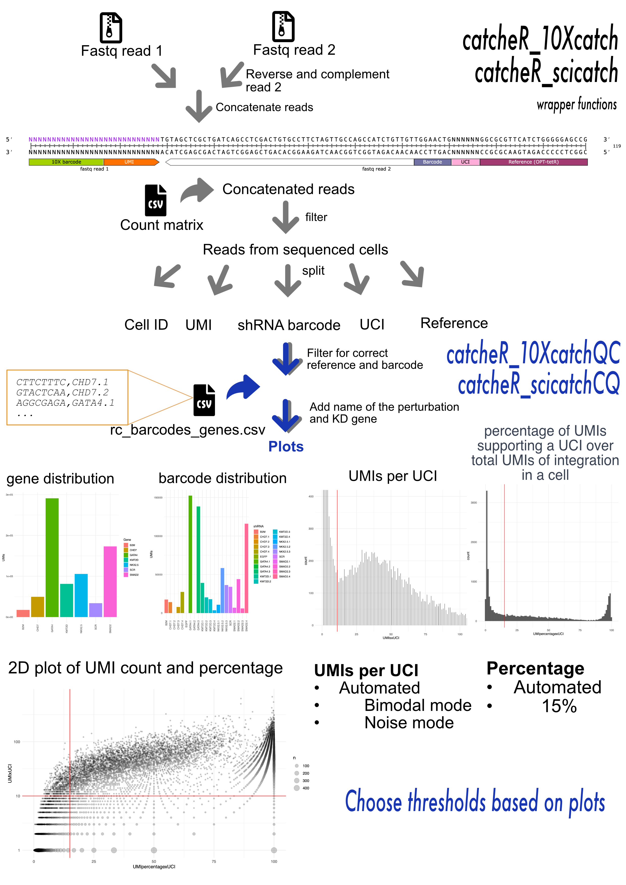
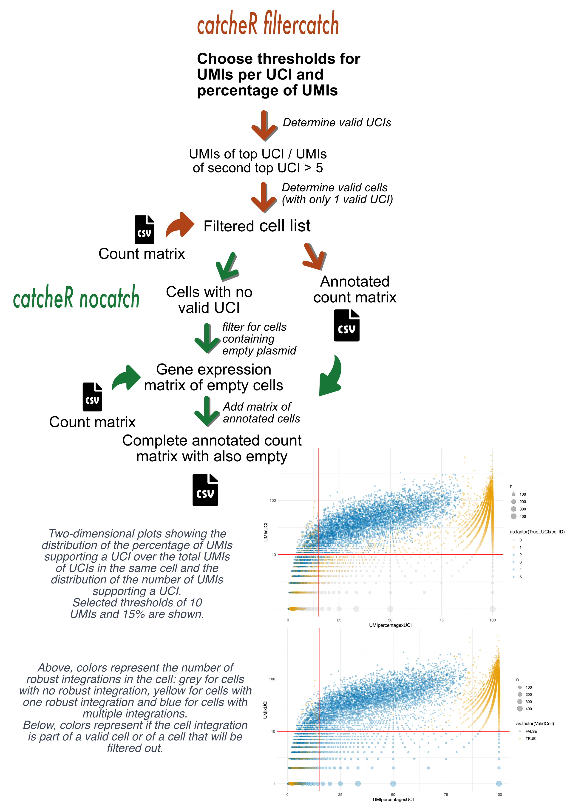

# HEDGe_iPS2-seq
Pipelines and codes relative to the hPS2-seq screening platform
Data analysis pipeline from HEDGe lab. 

See preprint DOI: XXXXXX.
See associated protocol and catcheR protocol 4 from preprint XXXXX.

Repository contains 2 sets of scripts: 

- CatcheR barcode pipeline curated by Maria Luisa Ratto: first step of the analysis, to assign perturbation to single cells.
  There are two different versions: one for 10X data (iPS2-10X-seq) and one for double indexing sci-RNAseq (iPS2-sci-seq). The DOCUMENTATION folder provides an overview of the workflow.
  
- single cell analysis curated by Elisa Balmas: Evaluate the perturbation effect of a gene or shRNA at the clonal or population level.
  Clustering is done with Monocle 3 and customized statistical methods have been employed to assess:
  (1) Cluster enrichment variation due to a perturbation; (2) Changes in Pseudotime or Module gene expression associated with a perturbation.
  Download the row data from array express (E-MTAB-14102, E-MTAB-14065, and E-MTAB-14066). The filtered and annotated data are available as RDS files on Zenodo DOI 10.5281/zenodo.11238212. To reproduce this pipeline fully, one can download the scratch folders (which also contain the count matrices output from catcheR pre-QC) and the associated files.

# CatcheR installation
Use the "install_github" function in the "devtools" package.

    library(devtools) 
    install_github("alessandro-bertero/catcheR")
    library(catcheR)

Alternatively, the repository can be download manually and loaded as follows: 

    library(devtools);
    load_all("."); # Working directory should be in the package catcheR

## Prerequisites
The following R functions require docker, since each of them opens a docker, computes the analysis inside of it to ensure reproducibility and then closes it. 

# Pipeline overview
For a detalied explaination of all the functions, see the protocol in DOCUMENTATION. 

